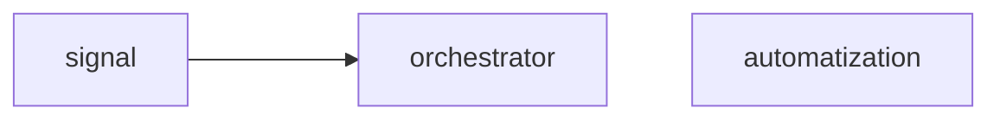

# Automatization

```mermaid
flowchart LR
    A[signal] ---> B[orchestrator] ~~~ C[automatization]

    click A "analytics/overview.md" "Open analytics"
    click B "database/overview.md" "Open database"
    click C "automatization/overview.md" "Open automatization"
```
